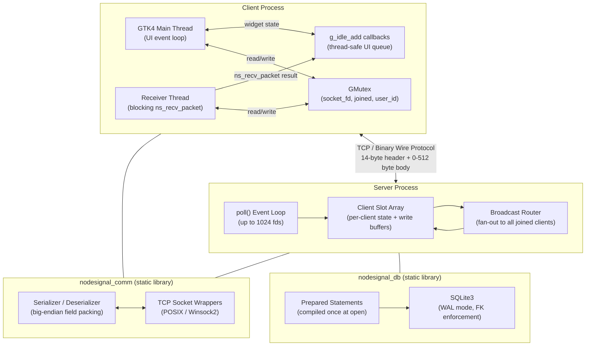
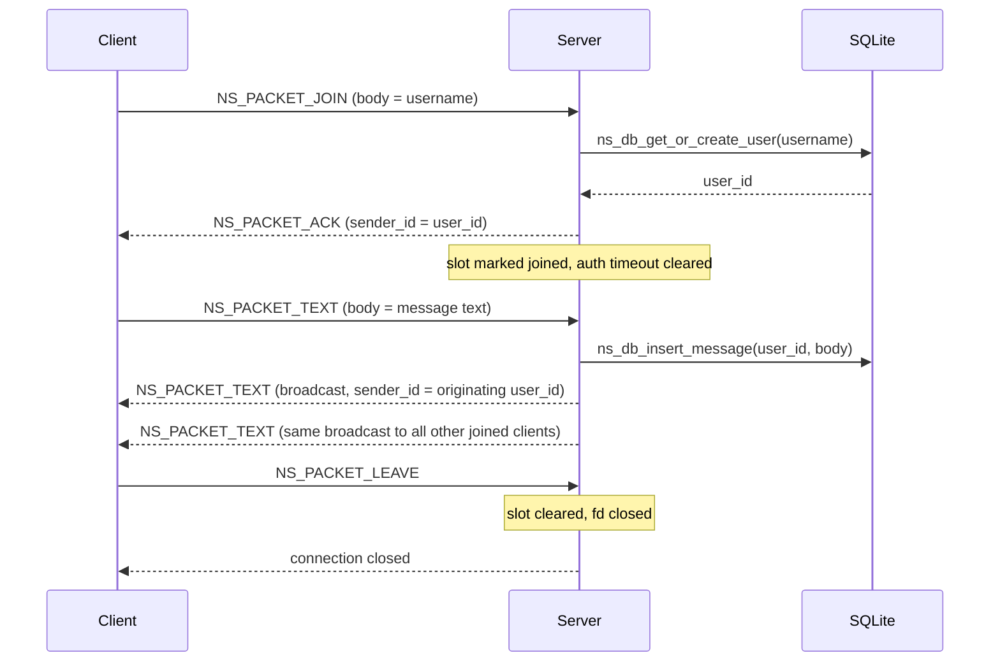
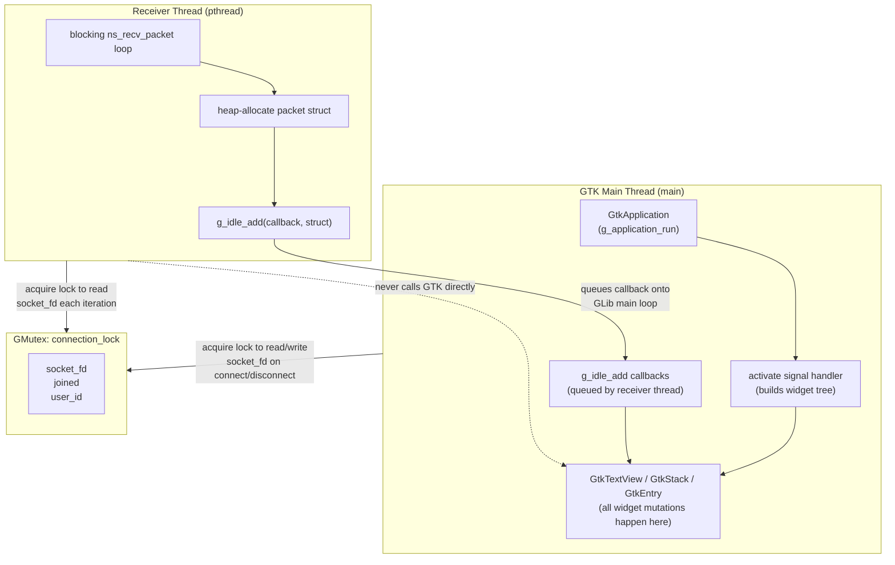
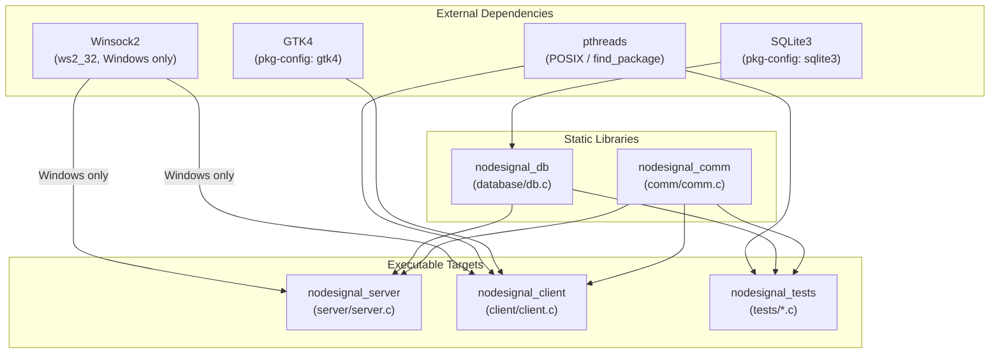

# NodeSignal Messenger

A multiclient TCP chat application written in C, built from the protocol layer up. The system consists of a `select()`/`poll()`-based socket server, a shared binary wire protocol, a SQLite persistence layer, and a GTK4 desktop client driven by a background receive thread. Every boundary between components is defined by a narrow, explicitly documented API, and the entire stack is covered by a 2,170 line test suite spanning unit, integration, and end-to-end scenarios.

## Table of Contents

1. [Architecture Overview](#1-architecture-overview)
2. [Architecture Diagrams](#2-architecture-diagrams)
3. [Client](#3-client)
4. [Communication Layer](#4-communication-layer)
5. [Server](#5-server)
6. [Database](#6-database)
7. [Spec Reflection](#7-spec-reflection)
8. [Test Suite](#8-test-suite)
9. [Limitations](#9-limitations)
10. [Setup and Launch](#10-setup-and-launch)

---

## 1. Architecture Overview

The repository is organized into four modules, each owning a distinct concern and exposing a narrow public interface. The modules form a directed dependency graph with no cycles: the client and server both link against `comm` and, where needed, `db`; neither module depends on the other.

At the transport layer, `comm/` provides a cross-platform TCP socket abstraction and owns the entire binary wire protocol. It handles serialization, deserialization, version checking, and all platform differences between POSIX and Winsock2. The `comm` module is compiled as a static library (`nodesignal_comm`) so both the client and server binaries link against an identical copy of the protocol code.

The `database/` module wraps SQLite behind six functions. It compiles all prepared statements at `ns_db_open` time and reuses them for every subsequent operation, which eliminates per-call parsing overhead and closes the most common class of SQL injection surface. The module is compiled as a second static library (`nodesignal_db`).

`server/` is a single-threaded event loop using `poll()` over a flat array of up to 1,024 client file descriptors. It maintains per-client state (join status, database user ID, username, authentication deadline, and a per-client outgoing write buffer) in a fixed-size slot array indexed by file descriptor position. All broadcasting is synchronous within the event loop iteration.

`client/` is a GTK4 application. The GTK main loop runs on the main thread and owns all widget state. A second POSIX thread performs blocking `ns_recv_packet` calls and communicates back to the main thread exclusively through `g_idle_add` callbacks, which queue UI mutations onto the GLib main loop. A `GMutex` guards the shared connection state (socket fd, join flag, user ID) accessed by both threads.

### Project Structure

```
NodeSignal-Messenger/
├── CMakeLists.txt          Build configuration (CMake 3.21+, C17)
├── Dockerfile              Docker build environment
├── nodesignal_tester.sh   Bash integration test runner
├── client/
│   ├── client.c           GTK4 application, receiver thread, UI callbacks (946 lines)
│   ├── client.h           Public entry point: ns_client_run()
│   ├── client.ui          GTK UI definition (XML, login + chat pages)
│   └── style.css          macOS-inspired stylesheet
├── comm/
│   ├── comm.c             Socket wrappers, serialization, packet I/O (655 lines)
│   └── comm.h             Public API + full protocol documentation (267 lines)
├── database/
│   ├── db.c               SQLite wrapper, prepared statements (385 lines)
│   ├── db.h               Public API (101 lines)
│   └── schema.sql         Reference schema (users, messages, indexes, pragmas)
├── server/
│   ├── server.c           poll()-based event loop, broadcast router (1049 lines)
│   └── server.h           Public entry point: ns_server_run()
└── tests/
    ├── test_main.c        Test harness entry point (49 lines)
    ├── test_packet.c      Protocol packet construction tests (97 lines)
    ├── test_db.c          Database round-trip tests (122 lines)
    ├── test_db_extended.c Extended database edge cases (590 lines)
    ├── test_comm.c        Socket and wire protocol tests (827 lines)
    └── test_integration.c End-to-end protocol exchange tests (485 lines)
```

---

## 2. Architecture Diagrams

### Repository Architecture



`nodesignal_comm` is statically linked into both the client and server, so the wire protocol implementation is byte-for-byte identical on both sides of the connection. The server is the only binary that links `nodesignal_db`; the client has no direct database access.

### Packet Architecture

```
Byte offset:  0        1        2        3        4        5        6        7
             +--------+--------+--------+--------+--------+--------+--------+--------+
             |version |  type  |          sender_id (32b, big-endian)       |  ...   |
             +--------+--------+--------+--------+--------+--------+--------+--------+

Byte offset:  8        9       10       11       12       13
             +--------+--------+--------+--------+--------+--------+
             |    timestamp (32b, big-endian)    | body_len MSB... |
             +--------+--------+--------+--------+--------+--------+

Byte offset: 14      ...     525
             +--------+--------+--------+----//----+--------+
             |        body (0 to 512 bytes, UTF-8)           |
             +--------+--------+--------+----//----+--------+

Total: 14-byte fixed header + 0..512 byte body  =  14..526 bytes per packet
```

Every packet begins with a 14-byte fixed-length header. The `version` byte is checked against `NS_PROTOCOL_VERSION` (currently `1`) on receipt; a mismatch causes the receiver to close the connection immediately. The `type` byte carries one of five `NsPacketType` values that determines how the body is interpreted. `sender_id` is the SQLite `users.id` assigned at join time; the server populates this field when broadcasting messages to other clients. `timestamp` is a Unix epoch value in seconds (32-bit, truncates in 2038). `body_len` is validated against `NS_PACKET_BODY_MAX` (512) before any read is attempted, preventing overflows.

The in-memory `NsPacketHeader` struct is explicitly not wire compatible with the 14-byte layout because C struct padding is compiler defined. `comm.c` serializes and deserializes every field individually using `ns_store_u32` / `ns_load_u32` helpers that perform explicit byte-by-byte big-endian packing.



The join handshake is the only stateful exchange. After `ACK`, all subsequent `TEXT` packets are routed without further negotiation. Clients that do not complete the join within `NS_AUTH_TIMEOUT_SECS` (10 seconds) are evicted by the server's timeout sweep inside the poll loop.

### Client Threading and UI Event Flow



The receiver thread owns the blocking network read path and is the only thread that calls `ns_recv_packet`. It never calls any GTK function. Instead, for each packet it receives, it allocates a small heap struct carrying the packet data and registers it with `g_idle_add`. The GLib main loop picks up each registered callback on the next idle tick and runs it on the main thread, where widget mutation is safe. The callback returns `G_SOURCE_REMOVE` so it fires exactly once and is then discarded.

The `GMutex` (`connection_lock`) guards the three fields that both threads access: `socket_fd`, `joined`, and `user_id`. The main thread holds the lock when initiating or tearing down a connection. The receiver thread acquires it briefly at the top of each loop iteration to read `socket_fd` before calling `ns_recv_packet`. The lock is never held across a blocking call, so neither thread can deadlock waiting on the other while also holding the mutex.

### CMake Build Graph



`nodesignal_comm` is the lowest-level target. It has no internal dependencies on other project libraries and is linked by every binary. It does carry a platform-conditional dependency on Winsock2 (`ws2_32`) on Windows; on POSIX systems the socket API is part of libc and requires no extra link flag.

`nodesignal_db` depends only on SQLite3 and is linked exclusively by the server and the test suite. The client binary has no link dependency on `nodesignal_db` and therefore cannot call any database function, which enforces the architectural rule that only the server touches persistent storage.

`nodesignal_client` is the only target that links GTK4 and pthreads. GTK4 is discovered via `pkg-config` at configure time, so a missing GTK4 development package causes a clear configure-time error rather than a link-time failure. The test target links both static libraries and pthreads so that `test_integration.c` can spawn a server thread in-process.

---

## 3. Client

`client/` implements the GTK4 desktop application. It is the only module with a graphical interface, and it is the only module that creates a POSIX thread at runtime.

### client.c

The application lifecycle follows the standard `GtkApplication` pattern: `ns_client_run` creates a `GtkApplication`, registers a `activate` signal handler that builds the widget tree, and calls `g_application_run`. All widget construction happens in `activate`; there is no global mutable widget state accessible before that signal fires.

The UI is split into two pages managed by a `GtkStack` with a crossfade transition:

- **Login page**: Three `GtkEntry` fields (server address, port, username) and a Connect button. The Connect handler reads the three fields, validates that none are empty, and calls `ns_connect_tcp` followed by `ns_send_packet` for `NS_PACKET_JOIN`. If either call fails, the status label is updated with the error string and the UI remains on the login page.
- **Chat page**: A `GtkScrolledWindow` containing a read-only `GtkTextView` (the transcript), a `GtkEntry` for message input, and a Send button. The Send handler calls `ns_send_packet` for `NS_PACKET_TEXT` and clears the input entry on success.

**Receiver thread.** After a successful join, `client.c` spawns a POSIX thread that loops on `ns_recv_packet`. For each packet received, the thread allocates a small heap struct carrying the packet data, then calls `g_idle_add` with a callback that reads the struct, appends to the `GtkTextView`, and frees the allocation. The callback returns `G_SOURCE_REMOVE` so it fires exactly once. This design means the receiver thread never calls any GTK function; all widget mutations happen on the main thread.

Shared connection state (`socket_fd`, `joined`, `user_id`) is protected by a `GMutex` (`connection_lock`). The receiver thread acquires the lock to read `socket_fd` at the start of each loop iteration; the main thread acquires it when initiating or tearing down a connection.

**UI event types dispatched via g_idle_add:**

| Event | Effect on UI |
|---|---|
| `NS_UI_APPEND_LINE` | Appends a formatted line to the transcript `GtkTextView` |
| `NS_UI_CONNECTED` | Switches the `GtkStack` to the chat page |
| `NS_UI_DISCONNECTED` | Switches back to the login page, resets state |
| `NS_UI_STATUS` | Updates the status label text |

### client.ui

Defines the widget tree as a GTK Builder XML file loaded at runtime via `gtk_builder_new_from_file`. The file is copied to `build/assets/client.ui` during CMake configuration so the binary can locate it relative to its executable directory using `ns_get_executable_dir`. UI assets are not embedded in the binary; the executable and the `assets/` directory must be co-located.

### style.css

Applied globally via `gtk_style_context_add_provider_for_display`. Implements a macOS inspired visual style: white window background, iOS blue (`#007aff`) buttons, light gray header bar (`#f5f5f7`), and rounded corner entries and text views.

---

## 4. Communication Layer

`comm/` is the shared protocol and networking library. It is the only module that has visibility into the binary wire format, and it is the only place where platform-specific socket APIs are conditioned. Both the server and client link against its compiled static library output.

### comm.h -- Public API

**Lifecycle and platform initialization:**

| Function | Description |
|---|---|
| `ns_net_init()` | Initializes Winsock2 on Windows; no-op on POSIX |
| `ns_net_cleanup()` | Cleans up Winsock2 on Windows; no-op on POSIX |

**Socket utilities:**

| Function | Description |
|---|---|
| `ns_socket_close(fd)` | Closes a socket fd (calls `closesocket` on Windows, `close` on POSIX) |
| `ns_socket_shutdown(fd)` | Shuts down both directions before close |
| `ns_socket_is_valid(fd)` | Returns true if fd is not the sentinel invalid value |
| `ns_last_error_string()` | Returns the last socket error as a human-readable string |
| `ns_get_executable_dir(buf, len)` | Fills `buf` with the directory containing the running executable (used to locate assets) |

**Networking:**

| Function | Description |
|---|---|
| `ns_connect_tcp(host, port)` | Connects to a TCP server; returns a valid socket fd or the invalid sentinel |
| `ns_listen_tcp(port)` | Binds and listens on a TCP port; returns the listening socket fd |
| `ns_unix_time_now()` | Returns current Unix time as `uint32_t` |

**Wire protocol:**

| Function | Description |
|---|---|
| `ns_packet_set(pkt, type, sender_id, body, body_len)` | Populates an `NsPacket` in memory; validates body_len against `NS_PACKET_BODY_MAX` |
| `ns_send_packet(fd, pkt)` | Serializes the packet header to 14 bytes (big-endian), then writes header + body to the socket |
| `ns_recv_packet(fd, pkt)` | Reads 14 header bytes, validates version and body_len, reads body_len body bytes into pkt |

### Wire Format Details

The in-memory and on-wire representations are intentionally decoupled. The `NsPacketHeader` struct carries the same fields but is not assumed to have any particular layout or alignment:

```c
typedef struct NsPacketHeader {
    uint8_t  version;    // NS_PROTOCOL_VERSION (1)
    uint8_t  type;       // NsPacketType
    uint32_t sender_id;  // users.id from SQLite
    uint32_t timestamp;  // Unix seconds (32-bit)
    uint32_t body_len;   // Bytes in body, 0..512
} NsPacketHeader;

typedef struct NsPacket {
    NsPacketHeader header;
    char body[NS_PACKET_BODY_MAX + 1]; // 513 bytes (512 payload + null terminator)
} NsPacket;
```

`ns_send_packet` serializes the header field by field into a 14-byte staging buffer before calling `send`. `ns_recv_packet` reads exactly 14 bytes into the same staging layout and deserializes. This approach is independent of compiler padding, struct alignment, or endianness of the host.

**Packet types:**

| Constant | Value | Direction | Body |
|---|---|---|---|
| `NS_PACKET_JOIN` | 1 | Client -> Server | Username string (1..`NS_USERNAME_MAX` bytes) |
| `NS_PACKET_TEXT` | 2 | Bidirectional | Message text (1..512 bytes) |
| `NS_PACKET_LEAVE` | 3 | Client -> Server | Empty |
| `NS_PACKET_ACK` | 4 | Server -> Client | Empty; `sender_id` = assigned `users.id` |
| `NS_PACKET_ERROR` | 5 | Server -> Client | Error description string |

**Protocol constants:**

| Constant | Value | Purpose |
|---|---|---|
| `NS_PROTOCOL_VERSION` | 1 | Version byte checked on every received packet |
| `NS_PACKET_BODY_MAX` | 512 | Maximum body bytes; enforced by both sender and receiver |
| `NS_USERNAME_MAX` | 32 | Maximum username length in bytes |

---

## 5. Server

`server/` implements a single-threaded, poll()-based socket server. It accepts up to 1,024 simultaneous TCP connections, manages per-client state through the join handshake, broadcasts text messages to all joined clients, and persists activity to the database.

### server.c

**Event loop.** `ns_server_run` opens the database, binds the listening socket, and enters a `poll()` loop over a flat `pollfd` array. Each iteration:

1. Calls `poll()` with a 1-second timeout (allowing the auth-timeout sweep to run even when no events arrive).
2. Checks the listening socket for `POLLIN`; accepts new connections and assigns them to the next free client slot.
3. Iterates all active client slots for `POLLIN`; calls `ns_recv_packet` and dispatches on `pkt.header.type`.
4. Iterates all active client slots for `POLLOUT`; drains per-client write buffers when the socket is ready.
5. Sweeps all active slots for authentication timeout (`NS_AUTH_TIMEOUT_SECS` = 10 seconds); evicts clients that have not sent `NS_PACKET_JOIN` within the deadline.

**Client slot array.** Each slot holds:

| Field | Type | Purpose |
|---|---|---|
| `socket_fd` | `NsSocket` | File descriptor for this connection |
| `active` | `bool` | Slot is occupied |
| `joined` | `bool` | Client has completed the join handshake |
| `user_id` | `uint32_t` | `users.id` assigned after successful join |
| `username` | `char[NS_USERNAME_MAX+1]` | Display name |
| `connect_time` | `uint32_t` | Unix time of connection, for auth timeout |
| `send_buf` | `char[NS_SEND_BUF_SIZE]` | Per-client outgoing ring buffer (2048 bytes) |
| `send_len` | `size_t` | Bytes pending in `send_buf` |

**Packet handling:**

- `NS_PACKET_JOIN`: Validates that the slot is not already joined, calls `ns_db_get_or_create_user`, marks the slot joined, responds with `NS_PACKET_ACK` (carrying the assigned `user_id` in `sender_id`). Duplicate usernames on the same server session result in an `NS_PACKET_ERROR` response.
- `NS_PACKET_TEXT`: Rejects if the client has not joined. Calls `ns_db_insert_message`, then fans out an `NS_PACKET_TEXT` to every other joined slot, writing into each slot's `send_buf`. The originating client receives the broadcast too (for echo confirmation).
- `NS_PACKET_LEAVE`: Marks the slot inactive, closes the file descriptor.
- Any other type from an unjoined client: responds with `NS_PACKET_ERROR` and closes the connection.

**Per-client write buffers.** Broadcast writes go into each recipient's `send_buf` rather than calling `send` directly. The `POLLOUT` drain path flushes the buffer when the socket is ready. This prevents a slow or blocked client from stalling the broadcast for all other clients.

**Capacity:**

| Constant | Value |
|---|---|
| `NS_MAX_CLIENTS` | 1024 clients |
| `NS_SEND_BUF_SIZE` | 2048 bytes |
| `NS_AUTH_TIMEOUT_SECS` | 10 seconds |

---

## 6. Database

`database/` wraps SQLite behind a six function API. All SQL is written as prepared statements compiled once at `ns_db_open` and reused for every subsequent call, which eliminates per-call parse overhead and removes parameterized injection surface.

### Schema

```sql
CREATE TABLE IF NOT EXISTS users (
    id         INTEGER PRIMARY KEY AUTOINCREMENT,
    username   TEXT    UNIQUE NOT NULL,
    created_at INTEGER NOT NULL
);

CREATE TABLE IF NOT EXISTS messages (
    id        INTEGER PRIMARY KEY AUTOINCREMENT,
    sender_id INTEGER NOT NULL REFERENCES users(id),
    body      TEXT    NOT NULL,
    sent_at   INTEGER NOT NULL
);

CREATE INDEX IF NOT EXISTS idx_messages_sender_id
    ON messages(sender_id);
```

SQLite pragmas applied at open time:

| Pragma | Value | Effect |
|---|---|---|
| `foreign_keys` | `ON` | Enforces `REFERENCES users(id)` on message inserts |
| `journal_mode` | `WAL` | Write-ahead logging; concurrent reads do not block writes |
| `busy_timeout` | `5000` | Waits up to 5 seconds before returning `SQLITE_BUSY` |

### db.h -- Public API

```c
typedef void (*NsMessageCallback)(const char *username,
                                  const char *body,
                                  uint32_t    sent_at,
                                  void       *userdata);

NsDatabase *ns_db_open(const char *path);
void         ns_db_close(NsDatabase *db);
bool         ns_db_init_schema(NsDatabase *db);
bool         ns_db_get_or_create_user(NsDatabase *db,
                                      const char *username,
                                      uint32_t    created_at,
                                      uint32_t   *out_id);
bool         ns_db_insert_message(NsDatabase *db,
                                  uint32_t    sender_id,
                                  const char *body,
                                  uint32_t    sent_at);
bool         ns_db_recent_messages(NsDatabase   *db,
                                   int           limit,
                                   NsMessageCallback cb,
                                   void         *userdata);
const char  *ns_db_last_error(NsDatabase *db);
```

**NsDatabase struct.** Holds the raw `sqlite3 *handle` and four `sqlite3_stmt *` pointers (one per prepared statement). Statements are finalized in `ns_db_close`.

**Prepared statements:**

| Statement | SQL summary |
|---|---|
| `stmt_find_user` | `SELECT id FROM users WHERE username = ?1` |
| `stmt_insert_user` | `INSERT OR IGNORE INTO users (username, created_at) VALUES (?1, ?2)` |
| `stmt_insert_message` | `INSERT INTO messages (sender_id, body, sent_at) VALUES (?1, ?2, ?3)` |
| `stmt_recent_messages` | `SELECT u.username, m.body, m.sent_at FROM messages m JOIN users u ON u.id = m.sender_id ORDER BY m.id DESC LIMIT ?1` |

`ns_db_get_or_create_user` runs `stmt_find_user` first; if the user does not exist it runs `stmt_insert_user` and calls `sqlite3_last_insert_rowid`. The `INSERT OR IGNORE` means a concurrent insert of the same username will silently succeed and the subsequent `SELECT` will return the existing row. `out_id` is written only on success.

`ns_db_recent_messages` invokes the caller supplied `NsMessageCallback` once per row in the result set, passing username, body, sent_at, and an opaque `userdata` pointer. This keeps the database layer independent of any display or formatting logic.

---

## 7. Spec Reflection

The assignment asked for a multiclient server that accepts connections, routes messages, and persists activity. The implementation delivers all three, and the engineering choices along the way reflect a deliberate layering discipline.

The decision to isolate all wire protocol code inside `comm/` paid off during testing. Because `ns_recv_packet` and `ns_send_packet` operate on file descriptors, the test suite could open POSIX socket pairs in a single process and exercise the full serialization path without starting the server binary. Every packet type, every rejection path (bad version, body overflow, unknown type), and every zero-body edge case is covered at this level before the integration tests exercise the server dispatch logic.

The decision to use `poll()` rather than `select()` was driven by correctness rather than performance. `select()` on Linux imposes an `FD_SETSIZE` limit of 1,024 that is checked at compile time but not enforced at runtime; assigning a file descriptor above that value produces undefined behavior in the fd_set bitmask. `poll()` takes a caller-allocated array sized by the caller, so the client slot array directly controls the maximum watched descriptor count without any hidden limit.

Per-client write buffers resolve the broadcast fairness problem. A naive implementation that calls `send` directly inside the broadcast loop will block if any one recipient's TCP send buffer is full, stalling delivery to all subsequent recipients for the duration of that blocked call. The `send_buf` approach defers the actual `send` to the `POLLOUT` path, where it runs only when the socket is confirmed ready and does not affect other clients.

The prepared statement approach in `database/` was chosen for correctness before efficiency. Compiling statements once at `ns_db_open` guarantees that SQL parse errors surface immediately on startup rather than during a message send. Binding parameters via `sqlite3_bind_*` rather than string interpolation eliminates injection risk at the database boundary, which is the only point in the system where externally originated data (usernames and message bodies from the network) touches SQL.

The separation between `NsPacketHeader` in memory and the 14-byte wire layout is the most structurally cautious choice in the codebase. Relying on struct layout for wire encoding introduces silent breakage whenever the compiler, platform, or optimization level changes. The explicit byte-by-byte serialization in `comm.c` is more code but is unambiguous about what byte lands at what offset on the wire.

What was not implemented reflects scope, not omission: there is no TLS, no authentication beyond username uniqueness, no per-user message history on reconnect, no room support beyond the single global channel, and no graceful server shutdown. These are documented as limitations rather than as future work, because the design choices throughout are calibrated to the current scope.

---

## 8. Test Suite

The `tests/` directory contains a CTest-integrated suite of 2,170 lines covering the protocol, database, networking, and end-to-end flows.

### Running the tests

Build the test binary alongside the other targets:

```sh
cmake -S . -B build
cmake --build build -j
```

Run with CTest:

```sh
ctest --test-dir build
```

Or run the test binary directly for verbose output:

```sh
./build/nodesignal_tests
```

The shell script `nodesignal_tester.sh` wraps the above for CI use.

### Test files

| File | Lines | Coverage |
|---|---|---|
| `test_main.c` | 49 | Test harness entry point and runner |
| `test_packet.c` | 97 | `ns_packet_set` basic construction, NULL body, body at exact max, body over max |
| `test_db.c` | 122 | `ns_db_get_or_create_user` idempotency, distinct IDs for distinct usernames, `ns_db_insert_message` + `ns_db_recent_messages` round-trip |
| `test_db_extended.c` | 590 | Null guard paths, message ordering (DESC by `id`), foreign key constraint enforcement, callback state capture, limit edge cases |
| `test_comm.c` | 827 | Socket validity predicates, `ns_unix_time_now` plausibility, null-safety of `ns_last_error_string` and `ns_get_executable_dir`, `ns_packet_set` for all five `NsPacketType` values, full header + body wire round-trip over a loopback socket pair, protocol version rejection, unknown type rejection, `body_len` overflow rejection, zero-body packets, `ns_listen_tcp` / `ns_connect_tcp` integration, shutdown and close on invalid sockets |
| `test_integration.c` | 485 | End-to-end client-server exchange over loopback: JOIN handshake, TEXT broadcast relay, LEAVE disconnection sequence |

### Coverage summary

Unit tests in `test_packet.c`, `test_db.c`, `test_db_extended.c`, and `test_comm.c` operate on individual functions with controlled inputs and assert on exact output contracts: field values, return codes, struct shapes, and numerical results. The wire round-trip tests in `test_comm.c` open a loopback socket pair within the test process so serialization and deserialization are verified against a live socket without running the server.

Integration tests in `test_integration.c` spawn a server thread and connect a client socket within the same process, driving the full packet dispatch path through `ns_server_run` and verifying that the server state machine responds correctly to each packet type in sequence.

---

## 9. Limitations

NodeSignal Messenger is a course project scoped to demonstrate multiclient TCP communication, a shared binary protocol, and SQLite persistence in C. The following constraints are deliberate and documented.

**Security.** All packets are transmitted in cleartext over TCP. There is no TLS, no transport encryption, and no integrity check on packet contents. There is no authentication mechanism beyond username uniqueness within the running server session; any client can claim any username that is not already connected. The system should not be deployed on a public network or used to transmit sensitive information.

**Authentication.** The join flow checks only that the requested username is not already active in the current server session. It does not verify identity, require a password, or issue a session token. A reconnecting client with the same username receives the same `users.id` from the database (because `INSERT OR IGNORE` preserves the existing row), but the server has no mechanism to prevent a different client from claiming that username if the original disconnects.

**Protocol year 2038 issue.** The `timestamp` field in the packet header is a 32-bit unsigned Unix timestamp. This value will overflow in 2038. The database `sent_at` and `created_at` columns store the same value as SQLite `INTEGER`, which is a 64-bit signed integer and does not have this limitation; the overflow is confined to the wire protocol.

**Single chat room.** All connected clients share one global broadcast channel. There is no concept of rooms, direct messages, or topics.

**No message history on reconnect.** The server does not replay recent messages to a client that reconnects. The `ns_db_recent_messages` function exists and is tested but is not called in the current server flow.

**No graceful server shutdown.** `ns_server_run` runs until the process is killed. There is no signal handler that closes client connections cleanly before exit.

**Packet body encoding.** The protocol treats the body as arbitrary bytes and documents it as UTF-8, but neither the server nor the client validates that incoming bodies are well-formed UTF-8. Malformed sequences are stored in the database and forwarded to other clients without sanitization.

**No TLS / encryption.** Noted separately from the authentication limitation because it is a distinct gap: even if authentication were added, the credential exchange and all subsequent traffic would travel in plaintext without transport layer security.

---

## 10. Setup and Launch

### Prerequisites

| Dependency | Version | Purpose |
|---|---|---|
| CMake | 3.21+ | Build system |
| C compiler | C17 | GCC, Clang, or MSVC |
| GTK4 dev | Any current | Client GUI |
| SQLite3 dev | Any current | Database library |
| pkg-config | Any | GTK4 discovery |

### Linux / macOS

Install dependencies:

```sh
# Debian/Ubuntu
sudo apt update
sudo apt install build-essential cmake pkg-config libgtk-4-dev libsqlite3-dev

# macOS (Homebrew)
brew install cmake gtk4 sqlite pkg-config
```

Configure and build:

```sh
cmake -S . -B build
cmake --build build -j
```

If you need to select a specific compiler:

```sh
cmake -S . -B build -DCMAKE_C_COMPILER=gcc
```

Run the server:

```sh
./build/nodesignal_server 5555 database/messages.db
```

Run one or more clients (each in a separate terminal):

```sh
./build/nodesignal_client
```

Run the test suite:

```sh
ctest --test-dir build
```

### Windows

NodeSignal supports Windows via MSYS2 UCRT64. Install [MSYS2](https://www.msys2.org/), then from the UCRT64 shell:

```sh
pacman -S mingw-w64-ucrt-x86_64-toolchain \
          mingw-w64-ucrt-x86_64-cmake \
          mingw-w64-ucrt-x86_64-gtk4 \
          mingw-w64-ucrt-x86_64-sqlite3 \
          mingw-w64-ucrt-x86_64-pkg-config
```

Configure and build:

```sh
cmake -S . -B build -G Ninja
cmake --build build -j
```

Run the server:

```sh
./build/nodesignal_server.exe 5555 database/messages.db
```

Run clients:

```sh
./build/nodesignal_client.exe
```

### Windows Packaged Distribution

To produce a self-contained distributable directory:

```sh
cmake -S . -B build-win -G Ninja
cmake --install build-win
cmake --install build-win --prefix dist
```

This produces:

```
dist/
├── bin/
│   ├── nodesignal_client.exe
│   ├── nodesignal_server.exe
│   ├── assets/
│   │   ├── client.ui
│   │   └── style.css
│   └── database/
```

The install step copies the GTK4 and SQLite3 runtime DLLs into `dist/bin`. The packaged server defaults to `dist/bin/database/messages.db`; the packaged client locates `assets/client.ui` and `assets/style.css` relative to its own executable directory.

Run from the dist layout:

```sh
./dist/bin/nodesignal_server.exe 5555
./dist/bin/nodesignal_client.exe
```

### Docker

Docker provides an alternative build environment without installing GTK4 or SQLite3 locally. Note that the resulting build produces server and test binaries only; the GTK4 client requires a display server and is not suitable for headless Docker execution.

Build the image:

```sh
docker build -t nodesignal-builder .
```

Configure and build inside the container:

```sh
docker run --rm \
  -v "$(pwd):/app" \
  nodesignal-builder \
  bash -c "mkdir -p build && cd build && cmake .. && make -j"
```

Run the test suite inside the container:

```sh
docker run --rm \
  -v "$(pwd):/app" \
  nodesignal-builder \
  bash -c "cd build && ctest"
```

### Stack

C17 · GTK4 · SQLite3 · CMake · pthreads · Winsock2 (Windows)
